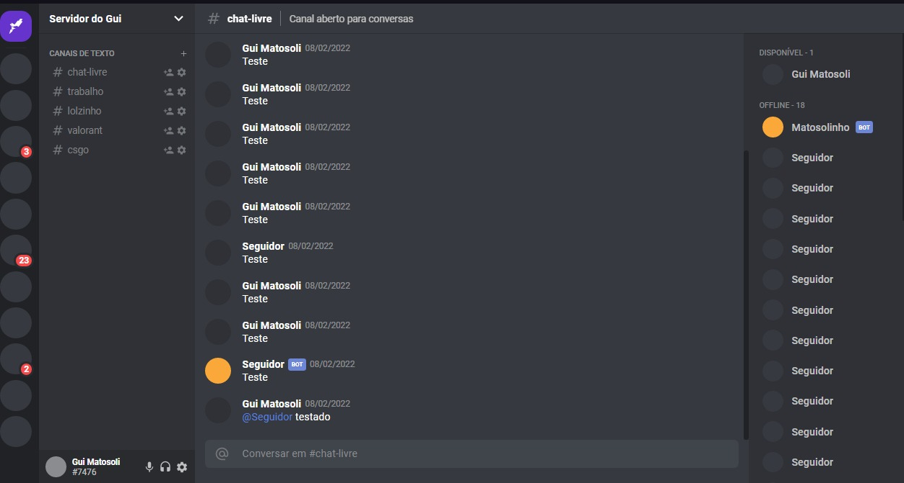

<h1 align='center'> Discord UI Clone</h1>

Discord UI clone (static until I got the guts to mess with it) to train ReactJS

Deployed <a href='#'>here<a> 

  

## Techs used in project
- [x] Styled-Components
- [x] TypeScript
- [x] ReactJS

## Future Implements

- [x] "Remove staticity" from the project;
- [x] Implement new features

## How to use (run projetc)

- Step 1 - Extract the files to your machine
- Step 2 - Open the terminal at the files adress
- Setp 3 - Execute yarn start (or npm run dev)

<h2 align='center'>Thanks for your attention<h2>

# by: Guilherme Matosoli   With guardianship: <a href='https://github.com/guilhermerodz'>Guilherme Rodz</a>
